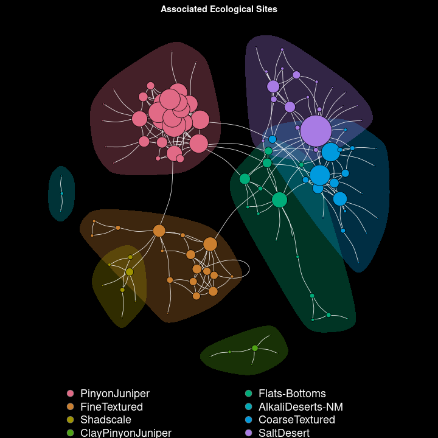

# EcologicalSiteDescriptionNetwork

An Ecological Site Description is used to by Land Management Agencies to group similar areas, or motifs, across a landscape. In theory these ecological sites, due to their similar biophysical, and climatic properties have similar soils and hence vegetation, and should respond in similar manners to land management. A tradeoff exists between producing many narrow descriptions, and several broader descriptions. 

In general the landscapes with ESD's completed are *somewhat* homogenous. However, a number of rare sites are still present. I argue that we can form, and as *needed* utilize broader conceptions of ESD's to supply context for rare sites across the landscape.

Here we utilize an Assess, Inventory, and Monitor (AIM) sample design, which had ESD verification occur at 130 plots to serve as a focal group of ESD's. From this focal group we branch outwards along the ESD documents 'similar and associated sites' (this name... my own) sections to develop a framework for relating the ESD's using simple binary and undirected associations. 

